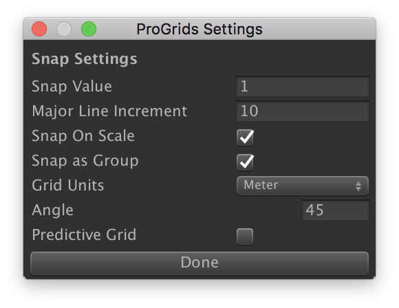

# The Interface

The ProGrids Panel displays the following buttons and options:

* **(1)** [Snap Size and Settings](#settings)
* **(2)** [Grid Visibility](#grid-vis)
* **(3)** [Snapping Enabled](#snap)
* **(4)** [Push to Grid](#push)
* **(5)** [Follow Grid](#follow)
* **(6)** [Set Grid Plane X](#gridX)
* **(7)** [Set Grid Plane Y](#gridY)
* **(8)** [Set Grid Plane Z](#gridZ)
* **(9)** [Perspective Grid](#perspective)

In addition, there are settings for [Angle Visibility](#angle-vis) and [Keyboard Shortcuts](#hotkeys).

##  Snap Size and Settings 

Click this button to open the snap settings window, where-in you can set snap increment and other settings.

Units are in meters by default, or you can choose inches, feet, etc. See the [Preferences](preferences.md) section for more details.

> ***Hint:*** Use the **+** and **-** keys to quickly change the Snap Size

| **Property** | **Description** |
|:--|:--|
| **Snap Value** | Set the increment to snap objects to in world coordinates |
| **Major Line Increment** | How many lines to show between highlighted lines |
| **Snap On Scale** | When enabled, applies snapping to object scale values |
| **Snap as Group** | When enabled, multiple selected objects retain their relative positions to one another when moving |
| **Grid Units** | Defines the unit of measurement that snap value is measured in |
| **Angle** | When in orthographic views an additional line is drawn at this angle |
| **Predictive Grid** | When enabled, ProGrids will automatically set the rendering grid plane according to object movement |

##  Grid Visibility 

Toggle the grid visuals on or off.

Note that objects will still snap with grid visibility toggled off.

##  Snapping Enabled 

Enable or disable snapping to the grid when moving objects.

##  Push to Grid 

Move all selected objects to on-grid positions, on each axis.

##  Follow Grid 

When enabled the grid will automatically move position itself at the origin of the current selection. When disabled (or "locked") the grid stays anchored at it's position.

While **locked** you can "nudge" the X, Y, or Z grid along it's axis by using the bracket (**[ ]**) keys.

##  Set Grid Plane X 

Set the grid to render on the **X** axis (facing to the left/right).

##  Set Grid Plane Y 

Set the grid to render on the **Y** axis (facing up/down).

##  Set Grid Plane Z

Set the grid to render on the **Z** axis (facing forwards/backwards).

##  Perspective Grid

Renders a grid with all 3 axes.

##  Angle Visibility

Toggle the visibility of the angle guides when in orthographic scene rendering mode.

## Keyboard Shortcuts

Single key shortcuts are enabled when the scene view is in focus.

**+** *or* **-** : Hit the "plus" or "minus" key to make the grid larger/smaller by one increment (see "Customizing ProGrids")

**[** *or* **]** : Use the bracket keys to nudge the X, Y, or Z grids perpendicular to their facing direction, by one increment.

**S** : Hold **S** to swap between Axis Constraint Modes (see "Axis Constraints", above)